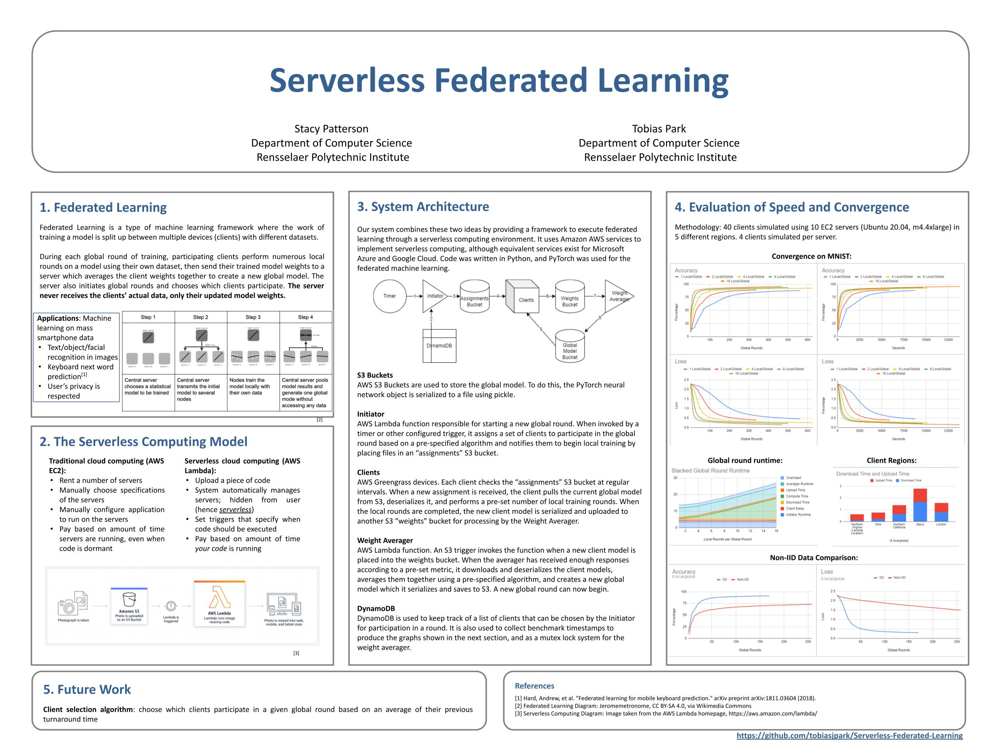

# Serverless Federated Learning
This project provides a framework for using federated learning to train machine learning models over edge devices and develop a federated learning framework using the serverless computing model on AWS Lambda/Greengrass. The code is written in Python 3 and uses PyTorch for all machine learning tasks.




# Folder Structure
```
└───initiator
│   │   
│   └───ChooseClients.py (customize how clients are selected)
│   └───lambda_function.py (main lambda function for initiating rounds)
│
└───client
│   │   
│   └───CreatePickle.py (customize how neural network data is serialized)
│   └───LoadData.py (customize how neural network data is loaded)
│   └───Net.py (customize the neural network architecture)
│   └───SleepTilNextRound.py (customize how clients wait for next round)
│   └───Train.py (customize how clients train the neural net)
│   └───client.py (main client runtime function)
│
└───utils
│   │   
│   └───create_empty_NN_file.py (script to create an empty neural network)
│   └───split_datasets.py (split a dataset into multiple parts for running experiments with multiple clients)
│
└───weight-averager
│   │   
│   └───averager
│   |   │   AverageModels.py (customize how client data is averaged together)
│   |   │   CheckThreshold.py (customize how to wait for clients to respond)
│   |   │   Net.py (customize the neural network architecture)
│   |   │   UpdateInitiatorTimer.py (customize how to dynamically update the initiator's timer)
│   |   │   app.py (main lambda function for averaging results)
```


# Architecture

The application uses S3 for storage and DynamoDB to keep track of a database of clients and for mutex locks. The rest of the project has four main components: the global model, the initiator, the group of clients, and the averager. 

## Global Model
This is a PyTorch machine learning model which is stored in S3. It represents the most up-to-date model. The global model will be updated in each round of federated learning. To save the PyTorch model to S3, the model object is converted to a dictionary and serialized to a file using pickle. It can then be deserialized with pickle and converted back into a python object. The `create_empty_NN_file.py` script in the utils folder can be used to create an initial file to start off with.

## Initiator
The initiator is an AWS Lambda function that initiates the beginning of a single round of training. It can be invoked manually through an API or by a timer at set intervals. When invoked, it kick starts a new round by selecting a subset of clients and notifying them to participate in the new round.

### Configuration Options
- ChooseClients.py: Edit the chooseClients function in this file to specify a custom algorithm for how clients should be chosen at the beginning of each global round. The function is called at the beginning of each global round; it is given as an argument a list `clients` of the names of all clients who are available for participation and must return a list of the names of clients chosen to participate in the next global round.

## Clients
The clients are any number of edge devices running our client code in AWS Greengrass. Each one has a dataset to train with stored locally on the device. Each client checks an S3 bucket periodically to detect the start of a new round. When the Initiator begins a new round, the clients see this and check whether they have been selected to participate. If so, they download the current global model, perform updates/training on it using their local dataset, and upload their resulting models to another S3 bucket. See the Installation/Setup section for instructions on where the client's dataset files should be located on the device.

### Configuration Options
- CreatePickle.py: Edit the createPickle function in this file to  prepare the pyTorch neural network to be pickled as a file. It is given an argument my_net (the pyTorch network object) and a reference to the pyTorch DataLoader object created in LoadData.py (see below). The DataLoader object is included in case the user wants to use data like the number of points in the dataset and include that information in the pickled object to be used later by the weight averager for a custom averaging algorithm. Whatever object is returned by the createPickle function is the object that is serialized and pickled.
- LoadData.py: Edit the loadData function in this file to control how the client's dataset is loaded. The id of the client is given as an argument. The function must return a pyTorch DataLoader object that represents its dataset.
- Net.py: Edit this file to describe the pyTorch neural network being used to train. This should match the Net.py file used by the Averager (see Averager section below). This file will be treated as the neural network object throuhout the rest of the code.
- SleepTilNextRound.py: Edit the sleepTilNextRound function to control how long a client waits in between checking for a new round. It is given an argument completed_round which is True if a round just finished and False otherwise. It is called after every time a client finishes checking for a round.
- Train.py: Edit the train function to control how the client performs local training on their model. The first 3 lines are constants that set the learning rate and momentum. The function takes the neural net object to train on, the DataLoader from LoadData.py (see above), and the number of epochs (number of local rounds per global round) to train over, respectively. It returns the trained neural net object.

## Averager
The averager is an AWS Lambda function. After a certain number of time has passed, or after enough clients have responded with their individual models, the averager takes all of the individual models returned by the clients and averages them together into a single model to create the new global model.

### Configuration Options
- AverageModels.py: This file controls which algorithm is used to averager the client models together. Set AVERAGING_ALGO to 0 to use unweighted averaging where each model is given equal weight and averaged. Set it to 1 to perform weighted averaging, where each model is given weight with proportion to the number of datasets that was used to train it. Set it to 2 to perform a custom algorithm, then define that custom algorithm in the customAlveragingAlgo function which takes as argument a list of objects that were pickled in CreatePickle.py on the clients (see client CreatePickle.py above) and returns a pyTorch neural net state dictionary. 
- CheckThreshold.py: Edit the checkThreshold function in this file to specify the threshold for how many clients must respond before the averager activates. The arguments bucket_set and assigned_set are sets containing the names of clients who have responded by placing their neural nets in the S3 bucket and the names of all clients that were assigned to participate in this round, respectively. The function should return True if the threshold has been met and False otherwise. The function is called each time the averager detects that a new client response has been received.
- Net.py: Edit this file to describe the pyTorch neural network being used to train. This should match the Net.py file used by the clients (see client section above). This file will be treated as the neural network object throuhout the rest of the code.
- UpdateInitiatorTimer.py: Edit the updateInitiatorTimer function if you want to dynamically change the amount of time that the Initiator waits before attempting to start a new round. This can be accomplished by making a boto3 call to the EventBridge timer that triggers the initiator: `client.put_rule(Name="invoke-initiator", ScheduleExpression="rate(" + str(new_length) + " minutes")`. The length of the last round that just completed is passed in as an argument.

# Installation/Setup
1. Download all the files from this repo into a folder.
2. Create S3 buckets with the following names:
    - client-assignments
    - client-weights
    - global-server-model
3. Deploy the Lambda functions
    - Initiator
      - Go into the initiator folder and package all of its contents into a ZIP file
      - In the AWS Management Console, create an AWS Lambda function named "initiator" and upload the ZIP file you created as the code
      - The Lambda Function must have an Execution Role that has the Permission Policies AmazonS3FullAccess, AmazonDynamoDBFullAccess, and AWSLambda_FullAccess 
      - Go to AWS Eventbridge and create a rule called "invoke-initiator". Under "Define Pattern", choose "Schedule" and enter a time interval. Under "Select Targets", select "Lambda Function" and choose the initiator function. Disable the rule for now.
    - Averager
      - The averager needs the PyTorch library in order to average the PyTorch models together. Because the PyTorch library is very large, the averager cannot be uploaded to AWS Lambda normally. Instead, we must use the following method as described here: https://aws.amazon.com/blogs/machine-learning/using-container-images-to-run-pytorch-models-in-aws-lambda/ . This essentially packages the function and its pytorch dependencies into a Docker file and uploads it to an Amazon ECR repository where it can be used as code for a Lambda function. This is summarized in the following steps:
        - Prerequisites:
          - The AWS Command Line Interface (AWS CLI) installed and configured to interact with AWS services locally
          - The AWS Serverless Application Model (AWS SAM) CLI installed
          - The Docker CLI
        - Create an Amazon ECR repository in AWS and register the local Docker to it. The repositoryUri is displayed in the output; save it for later.
          - Create an ECR repository: `aws ecr create-repository --repository-name lambda-pytorch-example --image-scanning-configuration scanOnPush=true --region <REGION>`

          - Register docker to ECR: `aws ecr get-login-password --region <REGION> | docker login --username AWS --password-stdin `

        - In the "weight-averager" folder, run sam build && sam deploy –-guided.
        - For Stack Name, enter weight-averager.
        - Choose the same Region that you created the Amazon ECR repository in.
        - Enter the image repository for the function (enter the earlier saved repositoryUri of the Amazon ECR repository).
        - For **Confirm changes before deploy** and **Allow SAM CLI IAM role creation**, keep the defaults.
        - For **pytorchEndpoint may not have authorization defined, Is this okay?**, select y.
        - Keep the defaults for the remaining prompts.
          - If you get a Docker error while running these commands, you may need to run `sudo chmod 666 /var/run/docker.sock`. Also, it appears that the Docker images/containers created during this process are not cleaned up automatically afterwards; you may want to pay attention to this especially if your system is low on disk space.
        - After the function is uploaded and set up, find it in the AWS Management Console. Under Configuration -> Permissions, give it an Execution Role that has the Permission Policies AmazonS3FullAccess, AmazonDynamoDBFullAccess, and AWSLambda_FullAccess 
        - In the AWS Management Console, in "Function Overview", click "Add Trigger" and add the bucket "client-weights" for object created events.
4. Set up DynamoDB
    - Create a table named "clients" with primary partition key "device_id" (String). This is used to keep track of all registered clients.
    - Create a table named "mutex-locked-clients" with primary partition key "ResourceId" (Number). This is used to implement mutex locking.
5. Set up clients
    - Note: The client code uses the hostname of the client device as its unique ID for the serverless federated learning system. For this reason, make sure that each client has a different hostname. Additionally, the semicolon character `;` should not be present in any hostname as this is a special character.
    - Make sure a relatively up-to-date version of Python 3 is installed on the client device.
    - Follow steps 1-3 to set up Greengrass V2 on each of your client devices: https://docs.aws.amazon.com/greengrass/v2/developerguide/getting-started.html#install-greengrass-v2
    - Greengrass V2 runs the client code in a separate Linux user account. To ensure that the client code has access to certain python libraries, they must be installed as root. 
    - Go to the client folder and run the following command to deploy the client code to your client device:

      ```
      sudo /greengrass/v2/bin/greengrass-cli deployment create \
      --recipeDir ~/greengrasstest/recipes \
      --artifactDir ~/greengrasstest/artifacts \
      --merge "com.federated.client=1.0.0"
      ```

    - If you desire, follow steps 5 and 6 in the above guide to create your component in the AWS IoT Greengrass service and more easily deploy it to multiple client devices with Greengrass V2 installed.

    - Greengrass unfortunately is rather picky in regards to allowing the client code to access the local filesystem. The client dataset files must be placed in `/greengrass/v2/packages/artifacts-unarchived/com.federated.client/`.

    - Greengrass also needs access to your AWS login information so that it can upload/download the models from S3. To do this...


Special thanks to my advisor Dr. Stacy Patterson, and to Timothy Castiglia for help with PyTorch.
